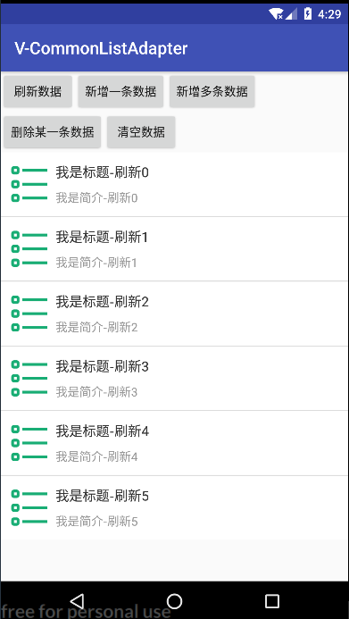

<p align="center">
   <a href="https://bintray.com/vension/vensionCenter/CommonListAdapter/_latestVersion">
    
  </a>
  <a href="https://travis-ci.org/Vension/V-CommonListAdapter">
    
  </a>
  <a href="https://developer.android.com/about/versions/android-4.0.html">
    
  </a>
  <a href="http://www.apache.org/licenses/LICENSE-2.0">
    
  </a>
  <a href="https://www.jianshu.com/u/38adb0e04e65">
    
  </a>
  <a href="https://shang.qq.com/wpa/qunwpa?idkey=1a5dc5e9b2e40a780522f46877ba243eeb64405d42398643d544d3eec6624917">
    
  </a>
</p>

# V-CommonListAdapter [  ](https://bintray.com/vension/vensionCenter/CommonListAdapter/_latestVersion)


## Preview
<p>
    
</p>
<p>
   
   
   
</p>


## Download

``` gradle
 implementation 'me.vension:CommonListAdapter:1.0.2'
```

## Usage

* **具体使用查看demo示例**
```java
val mList = ArrayList<TestBean>()
        for (i in 0..5) {
            val mBean = TestBean( R.drawable.image_03,"我是标题$i", "我是简介$i")
            mList.add(mBean)
        }
        mAdapter = object : CommonListAdapter<TestBean>(this,mList,R.layout.item_list){
            override fun convert(holder: CommonListViewHolder, position: Int, item: TestBean) {
                holder.setImageResource(R.id.iv_image,item.imageRes)
                holder.setText(R.id.tv_title,item.title)
                holder.setText(R.id.tv_desc,item.desc)
            }
        }

        listview.adapter = mAdapter
```

## update
* **V1.0.2**: <修改构造方法参数>
* **V1.0.1**: <新增kotlin版本>
* **V1.0.0**: <首次提交Java版本>


## About Me
* **Email**: <2506856664@qq.com>
* **Github**: <https://github.com/Vension>
* **简书**: <https://www.jianshu.com/u/38adb0e04e65>

## License
```
 Copyright 2018, Vension

   Licensed under the Apache License, Version 2.0 (the "License");
   you may not use this file except in compliance with the License.
   You may obtain a copy of the License at

       http://www.apache.org/licenses/LICENSE-2.0

   Unless required by applicable law or agreed to in writing, software
   distributed under the License is distributed on an "AS IS" BASIS,
   WITHOUT WARRANTIES OR CONDITIONS OF ANY KIND, either express or implied.
   See the License for the specific language governing permissions and
   limitations under the License.
```

